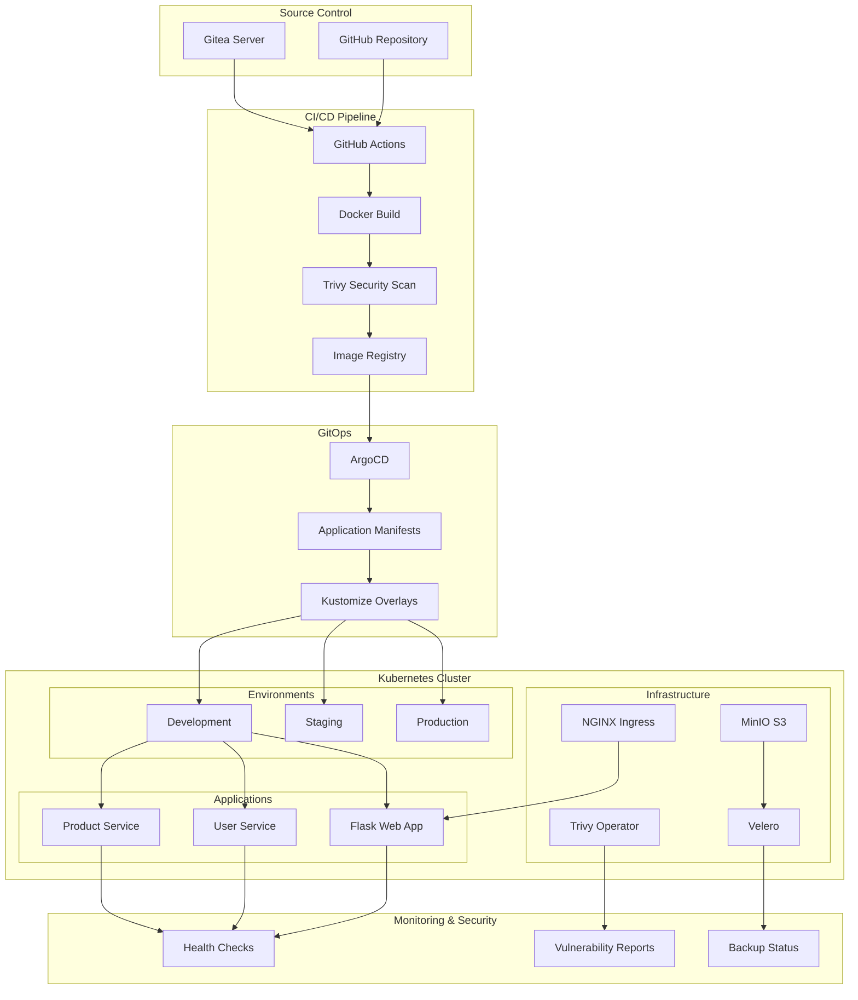
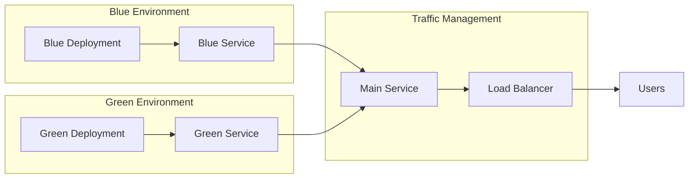
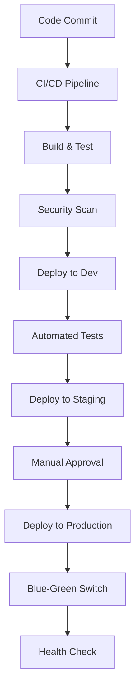
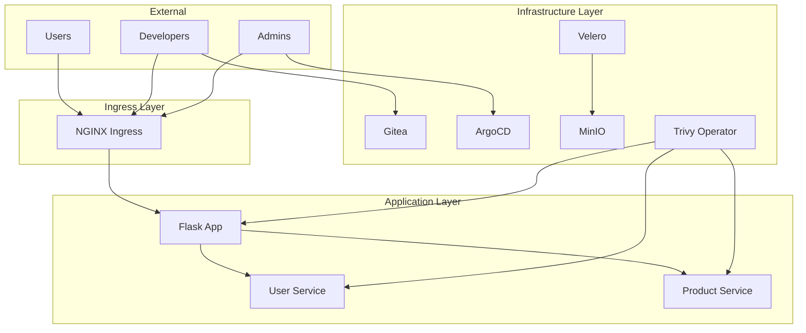
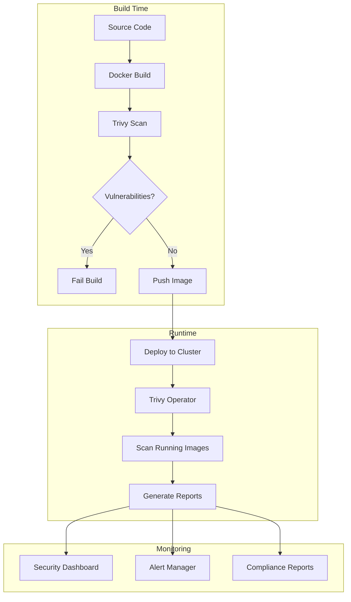
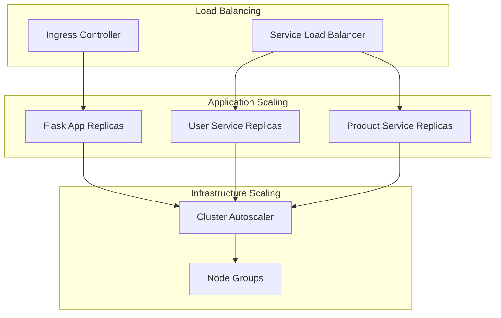
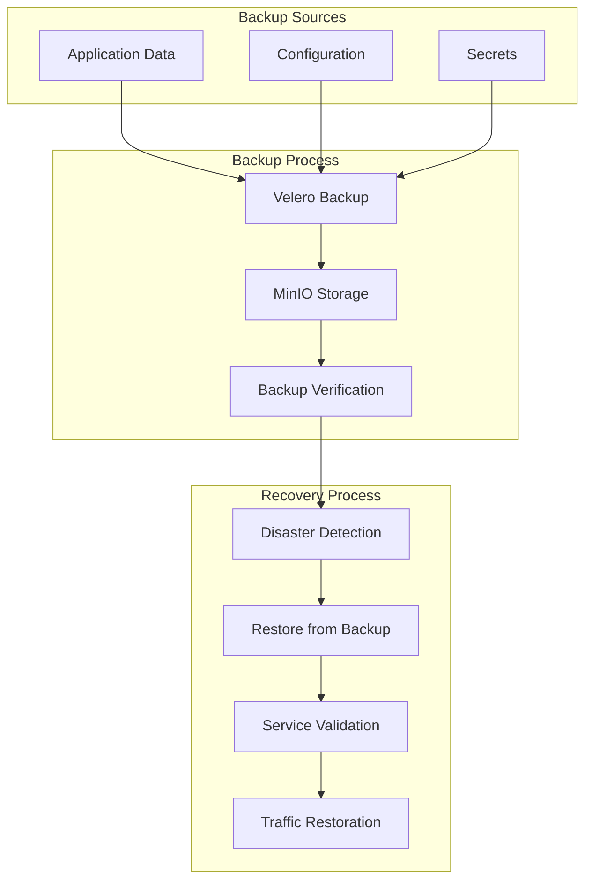

# Architecture Overview

This document provides a comprehensive overview of the DevOps Pipeline architecture, including all components, their interactions, and deployment strategies.

## System Architecture

## Component Details

### 1. Source Control & GitOps

#### GitHub Repository
- **Purpose**: Primary source control for application code and infrastructure
- **Structure**: Organized with apps, environments, and configuration directories
- **Branches**: `main` (production), `develop` (staging), feature branches

#### Gitea Server
- **Purpose**: Self-hosted Git server for PoC and internal repositories
- **Access**: http://gitea.local (admin/admin123)
- **Features**: Web UI, API access, webhook support

### 2. CI/CD Pipeline

#### GitHub Actions Workflow
- **Trigger**: Push to main/develop branches, pull requests
- **Stages**:
  1. Security scan with Trivy
  2. Build Docker images for all applications
  3. Push to container registry
  4. Update image tags in manifests
  5. Deploy to appropriate environment
  6. Run blue-green deployment
  7. Execute backup/restore tests
  8. Perform health checks

#### Docker Images
- **Flask App**: Python web application with Bootstrap UI
- **User Service**: REST API for user management
- **Product Service**: REST API for product management
- **Base Image**: Python 3.11-slim
- **Security**: Non-root user, health checks, resource limits

### 3. GitOps with ArgoCD

#### ArgoCD Configuration
- **Project**: `devops-pipeline-project` with RBAC
- **Applications**:
  - `devops-pipeline-dev`: Automated sync
  - `devops-pipeline-staging`: Manual sync
  - `devops-pipeline-prod`: Manual sync
  - `devops-pipeline-blue-green`: Blue-green deployments

#### Kustomize Overlays
- **Base**: Common application manifests
- **Dev**: Minimal resources, debug logging
- **Staging**: Production-like resources, info logging
- **Prod**: Full resources, warning logging, production optimizations

### 4. Kubernetes Infrastructure

#### Cluster Setup
- **Type**: kind (Kubernetes in Docker)
- **Nodes**: 1 control-plane + 2 workers
- **Ingress**: NGINX Ingress Controller
- **Storage**: Local persistent volumes

#### Namespaces
- `argocd`: ArgoCD components
- `gitea`: Gitea server
- `minio`: MinIO S3 storage
- `trivy-system`: Trivy Operator
- `velero`: Velero backup system
- `dev`: Development environment
- `staging`: Staging environment
- `production`: Production environment

### 5. Applications

#### Flask Web Application
- **Port**: 5000
- **Features**: Dashboard, user management, product management
- **Dependencies**: User Service, Product Service
- **Health Check**: `/api/health` endpoint

#### User Service
- **Port**: 5001
- **API**: RESTful CRUD operations for users
- **Data**: Mock user data with roles and permissions
- **Health Check**: `/api/health` endpoint

#### Product Service
- **Port**: 5002
- **API**: RESTful CRUD operations for products
- **Data**: Mock product data with categories and pricing
- **Health Check**: `/api/health` endpoint

### 6. Security & Monitoring

#### Trivy Integration
- **CLI**: Security scanning in CI/CD pipeline
- **Operator**: In-cluster vulnerability scanning
- **Reports**: SARIF format for GitHub Security tab
- **Severity**: HIGH and CRITICAL vulnerabilities fail builds

#### RBAC Configuration
- **ArgoCD**: Project-based access control
- **Kubernetes**: Service accounts with minimal privileges
- **Secrets**: Kubernetes secrets for sensitive data

### 7. Backup & Disaster Recovery

#### Velero Configuration
- **Provider**: AWS S3-compatible (MinIO)
- **Backup Location**: MinIO bucket `velero-backups`
- **Schedules**: Automated backups (configurable)
- **Restore**: Full namespace restore capability

#### MinIO Storage
- **Purpose**: S3-compatible object storage
- **Access**: http://minio.local (minioadmin/minioadmin123)
- **Buckets**: `velero-backups` for Velero

## Deployment Strategies

### Blue-Green Deployment

#### Process:
1. Deploy new version to inactive environment
2. Wait for health checks to pass
3. Switch traffic to new environment
4. Monitor for issues
5. Clean up old environment

### Environment Promotion

## Network Architecture

### Service Communication

### Port Configuration

| Service | Port | Type | Purpose |
|---------|------|------|---------|
| Flask App | 5000 | HTTP | Web application |
| User Service | 5001 | HTTP | User API |
| Product Service | 5002 | HTTP | Product API |
| Gitea | 3000 | HTTP | Git server |
| ArgoCD | 8080 | HTTP | GitOps UI |
| MinIO | 9000 | HTTP | S3 storage |
| NGINX Ingress | 80/443 | HTTP/HTTPS | Traffic routing |

## Security Architecture

### Container Security

### Network Security

- **Network Policies**: Restrict pod-to-pod communication
- **Ingress Security**: TLS termination and rate limiting
- **Service Mesh**: Future enhancement with Istio
- **Secrets Management**: Kubernetes secrets with encryption

## Scalability Considerations

### Horizontal Scaling

### Resource Management

- **Requests**: Minimum resource requirements
- **Limits**: Maximum resource usage
- **HPA**: Horizontal Pod Autoscaler (future)
- **VPA**: Vertical Pod Autoscaler (future)

## Monitoring & Observability

### Health Checks

- **Liveness Probes**: Container health monitoring
- **Readiness Probes**: Service availability
- **Startup Probes**: Application startup time

### Metrics Collection

- **Application Metrics**: Custom metrics endpoints
- **Infrastructure Metrics**: Node and pod metrics
- **Business Metrics**: User and product counts

### Logging

- **Application Logs**: Structured logging with levels
- **Infrastructure Logs**: Kubernetes and system logs
- **Audit Logs**: Security and compliance logs

## Disaster Recovery

### Backup Strategy

### Recovery Procedures

1. **RTO (Recovery Time Objective)**: < 30 minutes
2. **RPO (Recovery Point Objective)**: < 1 hour
3. **Testing**: Monthly disaster recovery drills
4. **Documentation**: Detailed recovery procedures

## Future Enhancements

### Planned Features

- **Service Mesh**: Istio integration for advanced traffic management
- **Observability**: Prometheus, Grafana, and Jaeger integration
- **GitOps**: Multi-cluster ArgoCD setup
- **Security**: Falco runtime security monitoring
- **Storage**: External storage solutions (AWS EBS, GCP Persistent Disk)

### Scalability Improvements

- **Multi-Cluster**: Cross-cluster deployments
- **Auto-Scaling**: HPA and VPA implementation
- **Load Testing**: Automated performance testing
- **Chaos Engineering**: Fault injection and resilience testing
