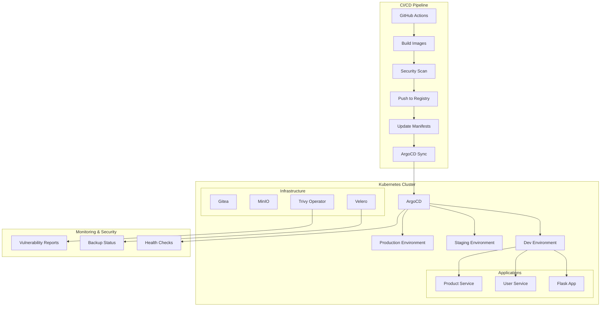

# DevOps Pipeline Documentation

Welcome to the **Unified Production-Ready DevOps Pipeline** documentation. This comprehensive guide covers the complete DevOps ecosystem that integrates Flask web application with microservices architecture, featuring GitOps with ArgoCD, automated CI/CD, container security scanning, multi-environment deployment, blue-green strategy, and backup & disaster recovery.

## 🚀 Quick Start

Get up and running in minutes:

```bash
# 1. Install prerequisites
chmod +x setup_prereqs.sh
./setup_prereqs.sh

# 2. Bootstrap cluster
chmod +x bootstrap_cluster.sh
./bootstrap_cluster.sh

# 3. Deploy pipeline
chmod +x deploy_pipeline.sh
./deploy_pipeline.sh

# 4. Health check
chmod +x check_env.sh
./check_env.sh
```

## 📋 What's Included

### Core Components

- **Flask Web Application**: Modern Python web app with Bootstrap UI
- **Microservices Architecture**: User Service and Product Service with REST APIs
- **GitOps Workflow**: ArgoCD for automated deployments
- **Git Server**: Self-hosted Gitea for PoC
- **Container Orchestration**: Kubernetes (kind/k3s)
- **Configuration Management**: Helm and Kustomize
- **Security Scanning**: Trivy CLI (CI) and Trivy Operator (in-cluster)
- **Backup & DR**: Velero with MinIO as S3 backend
- **Deployment Strategy**: Blue-Green Deployments
- **Documentation**: MkDocs-based documentation system

### Environments

- **Development**: Automated sync, minimal resources
- **Staging**: Manual sync, production-like resources
- **Production**: Manual sync, full resources, production optimizations

### Security Features

- Container vulnerability scanning with Trivy
- RBAC configurations for Kubernetes
- Network policies for service isolation
- Secrets management with Kubernetes secrets
- Image signing and verification workflows

## 🏗️ Architecture Overview



## 🔧 Key Features

### Automated Setup
- One-command installation of all dependencies
- Automated cluster bootstrap with all components
- Pre-configured environments and applications

### GitOps Workflow
- ArgoCD-managed deployments from Git
- Automated sync for development
- Manual approval for staging and production

### Multi-Environment Support
- Environment-specific configurations
- Resource scaling based on environment
- Separate secrets and configs per environment

### Security Integration
- Container vulnerability scanning
- Security reports in CI/CD pipeline
- In-cluster security monitoring

### Blue-Green Deployments
- Zero-downtime deployments
- Automated traffic switching
- Rollback capabilities

### Backup & Recovery
- Automated backups with Velero
- S3-compatible storage with MinIO
- Disaster recovery testing

## 📚 Documentation Structure

- **[Architecture](architecture.md)**: Detailed system architecture and components
- **[Quick Start](quick-start.md)**: Get started in minutes
- **[Runbooks](runbooks/)**: Operational procedures and guides
- **[Security](security.md)**: Security best practices and configurations
- **[Monitoring](monitoring.md)**: Monitoring and observability setup
- **[Troubleshooting](troubleshooting.md)**: Common issues and solutions
- **[API Reference](api-reference.md)**: API documentation for all services

## 🎯 Use Cases

This pipeline is perfect for:

- **Development Teams**: Rapid deployment and testing
- **DevOps Engineers**: Complete CI/CD automation
- **Security Teams**: Container security scanning
- **Operations Teams**: Production-ready deployments
- **Learning**: Understanding modern DevOps practices

## 🔒 Security Considerations

- Replace MinIO with cloud storage (AWS S3, GCS) for production
- Implement external secrets management
- Add monitoring and alerting (Prometheus/Grafana)
- Configure network policies and pod security policies
- Set up log aggregation and analysis

## 📞 Support

For questions, issues, or contributions:

- **Issues**: [GitHub Issues](https://github.com/your-org/devops-pipeline/issues)
- **Discussions**: [GitHub Discussions](https://github.com/your-org/devops-pipeline/discussions)
- **Documentation**: This site

## 📄 License

This project is licensed under the MIT License - see the [LICENSE](LICENSE) file for details.

---

**Ready to get started?** Check out the [Quick Start Guide](quick-start.md) or dive into the [Architecture Overview](architecture.md).
