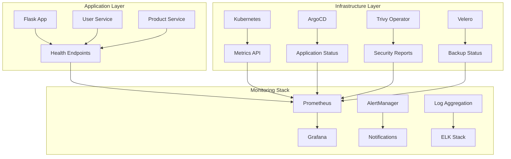

# Monitoring Guide

This guide covers monitoring, observability, and health checking for the DevOps Pipeline.

## Monitoring Architecture



## Health Monitoring

### Application Health Checks

#### Flask App Health Endpoint
```python
@app.route('/api/health')
def health():
    health_status = {
        'status': 'healthy',
        'timestamp': datetime.utcnow().isoformat(),
        'version': '1.0.0',
        'services': {}
    }
    
    # Check user service
    try:
        user_response = requests.get(f"{USER_SERVICE_URL}/api/health", timeout=2)
        health_status['services']['user_service'] = 'healthy' if user_response.status_code == 200 else 'unhealthy'
    except:
        health_status['services']['user_service'] = 'unhealthy'
    
    # Check product service
    try:
        product_response = requests.get(f"{PRODUCT_SERVICE_URL}/api/health", timeout=2)
        health_status['services']['product_service'] = 'healthy' if product_response.status_code == 200 else 'unhealthy'
    except:
        health_status['services']['product_service'] = 'unhealthy'
    
    return jsonify(health_status)
```

#### Kubernetes Health Checks
```yaml
# Liveness probe
livenessProbe:
  httpGet:
    path: /api/health
    port: 5000
  initialDelaySeconds: 30
  periodSeconds: 10
  timeoutSeconds: 5
  failureThreshold: 3

# Readiness probe
readinessProbe:
  httpGet:
    path: /api/health
    port: 5000
  initialDelaySeconds: 5
  periodSeconds: 5
  timeoutSeconds: 3
  failureThreshold: 3
```

### Infrastructure Health Checks

#### Cluster Health
```bash
# Check cluster status
kubectl cluster-info

# Check node status
kubectl get nodes

# Check pod status
kubectl get pods -A

# Check service status
kubectl get services -A
```

#### Component Health
```bash
# Check ArgoCD
kubectl get pods -n argocd
kubectl get applications -n argocd

# Check Gitea
kubectl get pods -n gitea

# Check MinIO
kubectl get pods -n minio

# Check Trivy Operator
kubectl get pods -n trivy-system

# Check Velero
kubectl get pods -n velero
```

## Automated Health Monitoring

### Health Check Script

The `check_env.sh` script provides comprehensive health monitoring:

```bash
# Run health check
./check_env.sh

# Check specific components
kubectl get pods -A
kubectl get applications -n argocd
kubectl get ingress -A
```

### Health Check Output

Expected healthy output:
```
✅ All health checks passed! 🎉
```

Unhealthy output example:
```
❌ Some health checks failed. Please review the output above.
```

## Metrics Collection

### Application Metrics

#### Flask App Metrics
```python
@app.route('/api/metrics')
def metrics():
    metrics_data = {
        'flask_app_requests_total': 1,
        'flask_app_uptime_seconds': 3600,
        'microservices_connected': 2
    }
    return jsonify(metrics_data)
```

#### Service Metrics
```python
# User Service metrics
@app.route('/api/metrics')
def metrics():
    return jsonify({
        'user_service_requests_total': len(users) * 10,
        'user_service_users_count': len(users),
        'user_service_uptime_seconds': 3600
    })

# Product Service metrics
@app.route('/api/metrics')
def metrics():
    return jsonify({
        'product_service_requests_total': len(products) * 15,
        'product_service_products_count': len(products),
        'product_service_uptime_seconds': 3600,
        'product_service_total_value': sum(p['price'] * p['stock'] for p in products)
    })
```

### Kubernetes Metrics

#### Resource Usage
```bash
# Check resource usage
kubectl top pods -A
kubectl top nodes

# Check resource limits
kubectl describe pods -A | grep -A 5 "Limits:"
```

#### Performance Metrics
```bash
# Check deployment status
kubectl get deployments -A

# Check replica sets
kubectl get replicasets -A

# Check horizontal pod autoscaler
kubectl get hpa -A
```

## Logging

### Application Logging

#### Structured Logging
```python
import logging
import json
from datetime import datetime

# Configure structured logging
logging.basicConfig(
    level=logging.INFO,
    format='%(asctime)s - %(name)s - %(levelname)s - %(message)s'
)
logger = logging.getLogger(__name__)

# Log with context
def log_request(endpoint, status_code, response_time):
    log_data = {
        'timestamp': datetime.utcnow().isoformat(),
        'endpoint': endpoint,
        'status_code': status_code,
        'response_time_ms': response_time,
        'service': 'flask-app'
    }
    logger.info(json.dumps(log_data))
```

#### Log Levels
- **DEBUG**: Detailed information for debugging
- **INFO**: General information about program execution
- **WARNING**: Something unexpected happened
- **ERROR**: A serious problem occurred
- **CRITICAL**: A very serious error occurred

### Infrastructure Logging

#### Kubernetes Logs
```bash
# Check application logs
kubectl logs -n dev deployment/flask-app
kubectl logs -n dev deployment/user-service
kubectl logs -n dev deployment/product-service

# Check infrastructure logs
kubectl logs -n argocd deployment/argocd-server
kubectl logs -n gitea deployment/gitea
kubectl logs -n minio deployment/minio
kubectl logs -n trivy-system deployment/trivy-operator
kubectl logs -n velero deployment/velero
```

#### System Logs
```bash
# Check system logs
sudo journalctl -u docker
sudo journalctl -u kubelet

# Check audit logs
sudo tail -f /var/log/audit/audit.log
```

## Alerting

### Health Check Alerts

#### Application Alerts
```bash
# Check for failed pods
kubectl get pods -A --field-selector=status.phase=Failed

# Check for pending pods
kubectl get pods -A --field-selector=status.phase=Pending

# Check for crash loop backoff
kubectl get pods -A | grep CrashLoopBackOff
```

#### Infrastructure Alerts
```bash
# Check for node issues
kubectl get nodes | grep NotReady

# Check for resource issues
kubectl describe nodes | grep -A 5 "Conditions:"

# Check for storage issues
kubectl get pv | grep Failed
```

### Custom Alerts

#### ArgoCD Application Alerts
```bash
# Check for out-of-sync applications
kubectl get applications -n argocd | grep OutOfSync

# Check for failed applications
kubectl get applications -n argocd | grep Failed

# Check for unknown applications
kubectl get applications -n argocd | grep Unknown
```

#### Security Alerts
```bash
# Check for high severity vulnerabilities
kubectl get vulnerabilityreports -A -o jsonpath='{range .items[*]}{.metadata.name}{"\t"}{.status.summary.criticalCount}{"\n"}{end}' | awk '$2 > 0'

# Check for failed security scans
kubectl get vulnerabilityreports -A | grep Failed
```

## Performance Monitoring

### Application Performance

#### Response Time Monitoring
```python
import time
from functools import wraps

def monitor_response_time(func):
    @wraps(func)
    def wrapper(*args, **kwargs):
        start_time = time.time()
        result = func(*args, **kwargs)
        end_time = time.time()
        response_time = (end_time - start_time) * 1000  # Convert to milliseconds
        
        logger.info(f"Response time for {func.__name__}: {response_time:.2f}ms")
        return result
    return wrapper

@monitor_response_time
@app.route('/api/users')
def get_users():
    # Implementation
    pass
```

#### Throughput Monitoring
```python
from collections import defaultdict
import threading

# Thread-safe counter
request_counter = defaultdict(int)
lock = threading.Lock()

def increment_counter(endpoint):
    with lock:
        request_counter[endpoint] += 1

@app.before_request
def before_request():
    increment_counter(request.endpoint)
```

### Infrastructure Performance

#### Resource Utilization
```bash
# Check CPU usage
kubectl top pods -A --sort-by=cpu

# Check memory usage
kubectl top pods -A --sort-by=memory

# Check storage usage
kubectl get pv
df -h
```

#### Network Performance
```bash
# Check network policies
kubectl get networkpolicies -A

# Check ingress status
kubectl get ingress -A

# Check service endpoints
kubectl get endpoints -A
```

## Monitoring Dashboards

### ArgoCD Dashboard

Access ArgoCD at http://argocd.local to monitor:
- Application sync status
- Deployment health
- Resource utilization
- Sync history

### Custom Monitoring Dashboard

#### Simple Health Dashboard
```html
<!DOCTYPE html>
<html>
<head>
    <title>DevOps Pipeline Health Dashboard</title>
    <meta http-equiv="refresh" content="30">
</head>
<body>
    <h1>DevOps Pipeline Health Dashboard</h1>
    
    <h2>Applications</h2>
    <div id="apps-status"></div>
    
    <h2>Infrastructure</h2>
    <div id="infra-status"></div>
    
    <script>
        // Fetch health status
        fetch('/api/health')
            .then(response => response.json())
            .then(data => {
                document.getElementById('apps-status').innerHTML = 
                    `<p>Flask App: ${data.status}</p>`;
            });
    </script>
</body>
</html>
```

## Troubleshooting Monitoring

### Common Issues

#### Health Check Failures
```bash
# Check pod logs
kubectl logs -n dev deployment/flask-app

# Check pod events
kubectl describe pod -n dev <pod-name>

# Check service endpoints
kubectl get endpoints -n dev
```

#### Metrics Collection Issues
```bash
# Check metrics endpoint
curl http://localhost:5000/api/metrics

# Check Prometheus targets
curl http://prometheus:9090/api/v1/targets

# Check Grafana data sources
curl http://grafana:3000/api/datasources
```

#### Logging Issues
```bash
# Check log aggregation
kubectl logs -n logging deployment/elasticsearch
kubectl logs -n logging deployment/kibana

# Check log forwarding
kubectl logs -n logging deployment/fluentd
```

### Monitoring Best Practices

1. **Set Up Alerts**: Configure alerts for critical issues
2. **Monitor Trends**: Track performance trends over time
3. **Log Aggregation**: Centralize logs for analysis
4. **Health Checks**: Implement comprehensive health checks
5. **Performance Baselines**: Establish performance baselines

## Next Steps

1. **Review Architecture**: Understand the [Architecture Overview](architecture.md)
2. **Security Monitoring**: Check [Security Guide](security.md)
3. **Troubleshooting**: Refer to [Troubleshooting Guide](troubleshooting.md)
4. **Operational Procedures**: Review [Runbooks](runbooks/)
5. **Custom Monitoring**: Implement custom monitoring solutions
