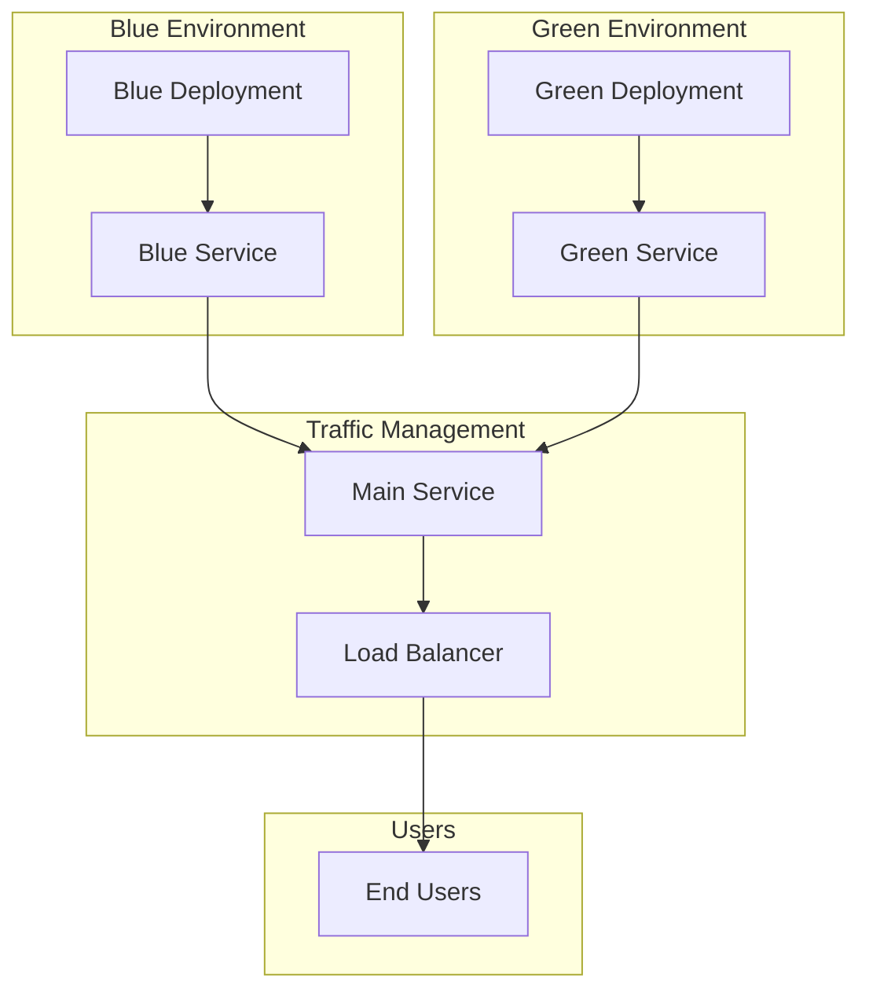

# Blue-Green Switch Runbook

This runbook covers blue-green deployment switching procedures for zero-downtime deployments.

## Blue-Green Deployment Overview

Blue-green deployment is a technique that reduces downtime and risk by running two identical production environments called Blue and Green. At any time, only one of the environments is live, with the other serving as a staging environment.

## Architecture



## Blue-Green Configuration

### Deployment Manifests

#### Blue Deployment
```yaml
apiVersion: apps/v1
kind: Deployment
metadata:
  name: flask-app-blue
  namespace: blue-green
  labels:
    app: flask-app
    version: blue
spec:
  replicas: 2
  selector:
    matchLabels:
      app: flask-app
      version: blue
  template:
    metadata:
      labels:
        app: flask-app
        version: blue
    spec:
      containers:
      - name: flask-app
        image: flask-app:latest
        ports:
        - containerPort: 5000
        env:
        - name: VERSION
          value: "blue"
        resources:
          requests:
            memory: "128Mi"
            cpu: "100m"
          limits:
            memory: "256Mi"
            cpu: "200m"
```

#### Green Deployment
```yaml
apiVersion: apps/v1
kind: Deployment
metadata:
  name: flask-app-green
  namespace: blue-green
  labels:
    app: flask-app
    version: green
spec:
  replicas: 2
  selector:
    matchLabels:
      app: flask-app
      version: green
  template:
    metadata:
      labels:
        app: flask-app
        version: green
    spec:
      containers:
      - name: flask-app
        image: flask-app:latest
        ports:
        - containerPort: 5000
        env:
        - name: VERSION
          value: "green"
        resources:
          requests:
            memory: "128Mi"
            cpu: "100m"
          limits:
            memory: "256Mi"
            cpu: "200m"
```

#### Main Service
```yaml
apiVersion: v1
kind: Service
metadata:
  name: flask-app
  namespace: blue-green
  labels:
    app: flask-app
spec:
  selector:
    app: flask-app
    version: blue  # Initially points to blue
  ports:
  - protocol: TCP
    port: 5000
    targetPort: 5000
  type: ClusterIP
```

## Switch Procedures

### Automated Switch Script

The `switch_blue_green.sh` script provides automated blue-green switching:

```bash
# Switch specific application
./switch_blue_green.sh flask-app 5000

# Run demo for all applications
./switch_blue_green.sh demo
```

### Manual Switch Procedures

#### 1. Deploy New Version to Inactive Environment
```bash
# Deploy new version to green environment
kubectl apply -f flask-app-green.yaml

# Wait for deployment to be ready
kubectl wait --for=condition=available --timeout=300s deployment/flask-app-green -n blue-green
```

#### 2. Run Health Checks
```bash
# Check green deployment health
kubectl get pods -n blue-green -l version=green

# Test green service directly
kubectl port-forward -n blue-green service/flask-app-green 5001:5000 &
curl http://localhost:5001/api/health

# Check application logs
kubectl logs -n blue-green deployment/flask-app-green
```

#### 3. Switch Traffic
```bash
# Update main service to point to green
kubectl patch service flask-app -n blue-green --type='merge' -p='{"spec":{"selector":{"version":"green"}}}'

# Verify traffic switch
kubectl get service flask-app -n blue-green -o jsonpath='{.spec.selector.version}'
```

#### 4. Monitor New Environment
```bash
# Monitor green environment
kubectl get pods -n blue-green -l version=green -w

# Check application metrics
curl http://flask-app.local/api/metrics

# Monitor logs
kubectl logs -f -n blue-green deployment/flask-app-green
```

#### 5. Cleanup Old Environment
```bash
# Scale down blue environment
kubectl scale deployment flask-app-blue --replicas=0 -n blue-green

# Delete blue service
kubectl delete service flask-app-blue -n blue-green
```

## Switch Validation

### Pre-Switch Validation
```bash
# Check current environment
kubectl get pods -n blue-green -l version=blue

# Check service endpoints
kubectl get endpoints -n blue-green

# Test current application
curl http://flask-app.local/api/health
```

### Post-Switch Validation
```bash
# Check new environment
kubectl get pods -n blue-green -l version=green

# Verify traffic routing
kubectl get service flask-app -n blue-green

# Test new application
curl http://flask-app.local/api/health
```

### Rollback Validation
```bash
# Check rollback environment
kubectl get pods -n blue-green -l version=blue

# Verify rollback traffic
kubectl get service flask-app -n blue-green

# Test rollback application
curl http://flask-app.local/api/health
```

## Rollback Procedures

### Automatic Rollback
```bash
# Switch back to blue environment
kubectl patch service flask-app -n blue-green --type='merge' -p='{"spec":{"selector":{"version":"blue"}}}'

# Scale up blue environment
kubectl scale deployment flask-app-blue --replicas=2 -n blue-green
```

### Manual Rollback
```bash
# Check current status
kubectl get pods -n blue-green

# Identify issues
kubectl logs -n blue-green deployment/flask-app-green

# Switch back to blue
kubectl patch service flask-app -n blue-green --type='merge' -p='{"spec":{"selector":{"version":"blue"}}}'

# Scale up blue
kubectl scale deployment flask-app-blue --replicas=2 -n blue-green

# Scale down green
kubectl scale deployment flask-app-green --replicas=0 -n blue-green
```

## Monitoring and Alerting

### Health Monitoring
```bash
# Monitor pod health
kubectl get pods -n blue-green -w

# Monitor service endpoints
kubectl get endpoints -n blue-green -w

# Monitor application health
curl -f http://flask-app.local/api/health
```

### Performance Monitoring
```bash
# Check resource usage
kubectl top pods -n blue-green

# Check application metrics
curl http://flask-app.local/api/metrics

# Monitor response times
curl -w "@curl-format.txt" -o /dev/null -s http://flask-app.local/api/health
```

### Alerting Configuration
```yaml
# Prometheus alerting rules
groups:
- name: blue-green
  rules:
  - alert: BlueGreenSwitchFailed
    expr: up{job="flask-app"} == 0
    for: 1m
    labels:
      severity: critical
    annotations:
      summary: "Blue-green switch failed"
      description: "Application is not responding after switch"
```

## Troubleshooting

### Common Issues

#### Switch Fails
```bash
# Check deployment status
kubectl get deployments -n blue-green

# Check pod status
kubectl get pods -n blue-green

# Check service status
kubectl get services -n blue-green

# Check events
kubectl get events -n blue-green --sort-by='.lastTimestamp'
```

#### Traffic Not Switching
```bash
# Check service selector
kubectl get service flask-app -n blue-green -o jsonpath='{.spec.selector}'

# Check pod labels
kubectl get pods -n blue-green --show-labels

# Check endpoints
kubectl get endpoints -n blue-green
```

#### Application Not Responding
```bash
# Check pod logs
kubectl logs -n blue-green deployment/flask-app-green

# Check pod status
kubectl describe pod -n blue-green <pod-name>

# Check resource usage
kubectl top pods -n blue-green
```

### Recovery Procedures

#### Emergency Rollback
```bash
# Immediate rollback
kubectl patch service flask-app -n blue-green --type='merge' -p='{"spec":{"selector":{"version":"blue"}}}'

# Scale up blue
kubectl scale deployment flask-app-blue --replicas=2 -n blue-green

# Scale down green
kubectl scale deployment flask-app-green --replicas=0 -n blue-green
```

#### Service Recovery
```bash
# Restart service
kubectl rollout restart deployment/flask-app-green -n blue-green

# Check rollout status
kubectl rollout status deployment/flask-app-green -n blue-green

# Verify recovery
kubectl get pods -n blue-green
```

## Best Practices

### Deployment Strategy

#### Gradual Rollout
```bash
# Deploy with canary strategy
kubectl patch service flask-app -n blue-green --type='merge' -p='{"spec":{"selector":{"version":"green"}}}'

# Monitor for issues
kubectl get pods -n blue-green -w

# Full switch if successful
kubectl patch service flask-app -n blue-green --type='merge' -p='{"spec":{"selector":{"version":"green"}}}'
```

#### Health Checks
```bash
# Implement comprehensive health checks
kubectl get pods -n blue-green -l version=green

# Test application functionality
curl http://flask-app.local/api/health
curl http://flask-app.local/api/users
curl http://flask-app.local/api/products
```

### Monitoring Strategy

#### Real-time Monitoring
```bash
# Monitor switch progress
kubectl get pods -n blue-green -w

# Monitor service endpoints
kubectl get endpoints -n blue-green -w

# Monitor application health
watch curl -s http://flask-app.local/api/health
```

#### Performance Monitoring
```bash
# Monitor resource usage
kubectl top pods -n blue-green

# Monitor application metrics
curl http://flask-app.local/api/metrics

# Monitor response times
curl -w "@curl-format.txt" -o /dev/null -s http://flask-app.local/api/health
```

## Automation

### CI/CD Integration

#### GitHub Actions
```yaml
# .github/workflows/blue-green.yml
name: Blue-Green Deployment

on:
  push:
    branches: [ main ]

jobs:
  blue-green:
    runs-on: ubuntu-latest
    steps:
    - name: Checkout code
      uses: actions/checkout@v4
    
    - name: Set up kubectl
      uses: azure/setup-kubectl@v3
    
    - name: Deploy to green
      run: |
        kubectl apply -f environments/blue-green/green/
        kubectl wait --for=condition=available --timeout=300s deployment/flask-app-green -n blue-green
    
    - name: Switch traffic
      run: |
        kubectl patch service flask-app -n blue-green --type='merge' -p='{"spec":{"selector":{"version":"green"}}}'
    
    - name: Verify switch
      run: |
        kubectl get service flask-app -n blue-green -o jsonpath='{.spec.selector.version}'
        curl -f http://flask-app.local/api/health
```

#### ArgoCD Integration
```yaml
# ArgoCD application for blue-green
apiVersion: argoproj.io/v1alpha1
kind: Application
metadata:
  name: devops-pipeline-blue-green
  namespace: argocd
spec:
  project: devops-pipeline-project
  source:
    repoURL: https://github.com/your-org/devops-pipeline
    targetRevision: HEAD
    path: environments/blue-green
  destination:
    server: https://kubernetes.default.svc
    namespace: blue-green
  syncPolicy:
    automated:
      prune: false
      selfHeal: false
    syncOptions:
    - CreateNamespace=true
```

## Next Steps

1. **Review Architecture**: Understand the [Architecture Overview](architecture.md)
2. **CI/CD Pipeline**: Check [CI/CD Pipeline Runbook](cicd-pipeline.md)
3. **GitOps Sync**: Review [GitOps Sync Runbook](gitops-sync.md)
4. **Disaster Recovery**: Check [DR Restore Runbook](dr-restore.md)
5. **Monitoring**: Review [Monitoring Guide](monitoring.md)
6. **Troubleshooting**: Refer to [Troubleshooting Guide](troubleshooting.md)
