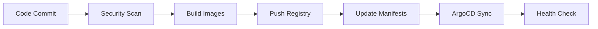

# CI/CD Pipeline Runbook

This runbook covers the CI/CD pipeline workflow, including build processes, security scanning, and deployment strategies.

## Pipeline Overview

The CI/CD pipeline consists of several stages:



## Pipeline Stages

### 1. Security Scan

**Purpose**: Identify vulnerabilities in source code and dependencies

**Tools**: Trivy CLI

**Process**:
```bash
# Install Trivy
curl -sfL https://raw.githubusercontent.com/aquasecurity/trivy/main/contrib/install.sh | sh -s -- -b /usr/local/bin

# Scan filesystem
trivy fs --severity HIGH,CRITICAL .

# Scan specific files
trivy fs --severity HIGH,CRITICAL apps/flask-app/
```

**Failure Criteria**:
- HIGH or CRITICAL vulnerabilities found
- Security policy violations
- Dependency vulnerabilities

**Resolution**:
- Update vulnerable dependencies
- Apply security patches
- Review and accept risk (if justified)

### 2. Build Images

**Purpose**: Create containerized applications

**Process**:
```bash
# Build Flask app
cd apps/flask-app
docker build -t flask-app:latest .

# Build User service
cd ../microservice-1
docker build -t user-service:latest .

# Build Product service
cd ../microservice-2
docker build -t product-service:latest .
```

**Best Practices**:
- Use multi-stage builds
- Run as non-root user
- Include health checks
- Set resource limits
- Use specific base image tags

### 3. Security Scan Images

**Purpose**: Scan built images for vulnerabilities

**Process**:
```bash
# Scan Flask app image
trivy image --severity HIGH,CRITICAL flask-app:latest

# Scan User service image
trivy image --severity HIGH,CRITICAL user-service:latest

# Scan Product service image
trivy image --severity HIGH,CRITICAL product-service:latest
```

**Output**: SARIF format for GitHub Security tab

### 4. Push to Registry

**Purpose**: Store images in container registry

**Process**:
```bash
# Tag images
docker tag flask-app:latest ghcr.io/your-org/devops-pipeline/flask-app:latest
docker tag user-service:latest ghcr.io/your-org/devops-pipeline/user-service:latest
docker tag product-service:latest ghcr.io/your-org/devops-pipeline/product-service:latest

# Push images
docker push ghcr.io/your-org/devops-pipeline/flask-app:latest
docker push ghcr.io/your-org/devops-pipeline/user-service:latest
docker push ghcr.io/your-org/devops-pipeline/product-service:latest
```

### 5. Update Manifests

**Purpose**: Update Kubernetes manifests with new image tags

**Process**:
```bash
# Update image tags in dev environment
find environments/dev -name "*.yaml" -exec sed -i "s|image: .*:latest|image: ghcr.io/your-org/devops-pipeline/flask-app:latest|g" {} \;

# Commit changes
git add environments/dev/
git commit -m "Update image tags for dev deployment"
git push
```

### 6. ArgoCD Sync

**Purpose**: Deploy applications to Kubernetes

**Process**:
```bash
# Sync dev environment (automated)
kubectl patch application devops-pipeline-dev -n argocd --type merge --patch '{"spec":{"syncPolicy":{"automated":{"prune":true,"selfHeal":true}}}}'

# Sync staging environment (manual)
argocd app sync devops-pipeline-staging --server $ARGOCD_SERVER --auth-token $ARGOCD_TOKEN

# Sync production environment (manual)
argocd app sync devops-pipeline-prod --server $ARGOCD_SERVER --auth-token $ARGOCD_TOKEN
```

## Environment-Specific Deployments

### Development Environment

**Characteristics**:
- Automated sync
- Minimal resources
- Debug logging enabled
- Fast feedback loop

**Configuration**:
```yaml
# environments/dev/kustomization.yaml
apiVersion: kustomize.config.k8s.io/v1beta1
kind: Kustomization

resources:
- ../../apps/flask-app/deployment.yaml
- ../../apps/microservice-1/deployment.yaml
- ../../apps/microservice-2/deployment.yaml

namespace: dev

patchesStrategicMerge:
- |-
  apiVersion: apps/v1
  kind: Deployment
  metadata:
    name: flask-app
  spec:
    replicas: 1
    template:
      spec:
        containers:
        - name: flask-app
          resources:
            requests:
              memory: "64Mi"
              cpu: "50m"
            limits:
              memory: "128Mi"
              cpu: "100m"
```

### Staging Environment

**Characteristics**:
- Manual sync approval
- Production-like resources
- Info logging
- Integration testing

**Configuration**:
```yaml
# environments/staging/kustomization.yaml
apiVersion: kustomize.config.k8s.io/v1beta1
kind: Kustomization

resources:
- ../../apps/flask-app/deployment.yaml
- ../../apps/microservice-1/deployment.yaml
- ../../apps/microservice-2/deployment.yaml

namespace: staging

patchesStrategicMerge:
- |-
  apiVersion: apps/v1
  kind: Deployment
  metadata:
    name: flask-app
  spec:
    replicas: 2
    template:
      spec:
        containers:
        - name: flask-app
          resources:
            requests:
              memory: "128Mi"
              cpu: "100m"
            limits:
              memory: "256Mi"
              cpu: "200m"
```

### Production Environment

**Characteristics**:
- Manual sync approval
- Full resources
- Warning logging
- Production optimizations

**Configuration**:
```yaml
# environments/prod/kustomization.yaml
apiVersion: kustomize.config.k8s.io/v1beta1
kind: Kustomization

resources:
- ../../apps/flask-app/deployment.yaml
- ../../apps/microservice-1/deployment.yaml
- ../../apps/microservice-2/deployment.yaml

namespace: production

patchesStrategicMerge:
- |-
  apiVersion: apps/v1
  kind: Deployment
  metadata:
    name: flask-app
  spec:
    replicas: 3
    template:
      spec:
        containers:
        - name: flask-app
          resources:
            requests:
              memory: "256Mi"
              cpu: "200m"
            limits:
              memory: "512Mi"
              cpu: "400m"
```

## Pipeline Triggers

### GitHub Actions Triggers

```yaml
on:
  push:
    branches: [ main, develop ]
  pull_request:
    branches: [ main ]
```

### Manual Triggers

```bash
# Trigger pipeline manually
gh workflow run ci-cd.yml

# Trigger specific job
gh workflow run ci-cd.yml --ref main
```

## Pipeline Monitoring

### GitHub Actions Dashboard

Access the Actions tab in your GitHub repository to monitor:
- Pipeline status
- Build logs
- Test results
- Security scan results

### ArgoCD Dashboard

Access ArgoCD at http://argocd.local to monitor:
- Application sync status
- Deployment health
- Resource utilization
- Sync history

### Health Checks

```bash
# Run comprehensive health check
./check_env.sh

# Check specific components
kubectl get pods -A
kubectl get applications -n argocd
kubectl get ingress -A
```

## Troubleshooting

### Common Issues

#### Build Failures

**Symptoms**:
- Docker build fails
- Image push fails
- Dependency issues

**Resolution**:
```bash
# Check Docker daemon
sudo systemctl status docker

# Check disk space
df -h

# Check Docker logs
docker logs <container-id>

# Rebuild with verbose output
docker build --no-cache -t flask-app:latest .
```

#### Security Scan Failures

**Symptoms**:
- HIGH/CRITICAL vulnerabilities found
- Security policy violations

**Resolution**:
```bash
# Check specific vulnerabilities
trivy image --severity HIGH,CRITICAL flask-app:latest

# Update base image
# Edit Dockerfile to use newer base image

# Review and accept risk
# Update security policy if justified
```

#### ArgoCD Sync Issues

**Symptoms**:
- Applications not syncing
- Sync failures
- Resource conflicts

**Resolution**:
```bash
# Check application status
kubectl get applications -n argocd

# Check sync status
argocd app get devops-pipeline-dev

# Force sync
argocd app sync devops-pipeline-dev --force

# Check logs
kubectl logs -n argocd deployment/argocd-server
```

#### Deployment Issues

**Symptoms**:
- Pods not starting
- Services not accessible
- Ingress not working

**Resolution**:
```bash
# Check pod status
kubectl get pods -n dev

# Check pod logs
kubectl logs -n dev deployment/flask-app

# Check service status
kubectl get services -n dev

# Check ingress status
kubectl get ingress -n dev

# Check events
kubectl get events -n dev
```

## Best Practices

### Security

1. **Scan Early**: Run security scans in early pipeline stages
2. **Fail Fast**: Stop pipeline on HIGH/CRITICAL vulnerabilities
3. **Update Regularly**: Keep base images and dependencies updated
4. **Least Privilege**: Use minimal required permissions

### Performance

1. **Parallel Builds**: Build multiple images in parallel
2. **Caching**: Use Docker layer caching
3. **Resource Limits**: Set appropriate resource limits
4. **Health Checks**: Implement proper health checks

### Reliability

1. **Idempotent**: Ensure pipeline steps are idempotent
2. **Rollback**: Implement rollback procedures
3. **Monitoring**: Monitor pipeline health
4. **Testing**: Include comprehensive testing

## Pipeline Customization

### Adding New Applications

1. **Create Application Directory**:
```bash
mkdir apps/new-service
```

2. **Add Dockerfile**:
```dockerfile
FROM python:3.11-slim
WORKDIR /app
COPY requirements.txt .
RUN pip install -r requirements.txt
COPY . .
EXPOSE 5000
CMD ["python", "app.py"]
```

3. **Add Kubernetes Manifests**:
```yaml
apiVersion: apps/v1
kind: Deployment
metadata:
  name: new-service
spec:
  replicas: 2
  selector:
    matchLabels:
      app: new-service
  template:
    metadata:
      labels:
        app: new-service
    spec:
      containers:
      - name: new-service
        image: new-service:latest
        ports:
        - containerPort: 5000
```

4. **Update Kustomize Overlays**:
```yaml
# environments/dev/kustomization.yaml
resources:
- ../../apps/new-service/deployment.yaml
```

5. **Update CI/CD Pipeline**:
```yaml
# .github/workflows/ci-cd.yml
strategy:
  matrix:
    app: [flask-app, microservice-1, microservice-2, new-service]
```

### Customizing Security Policies

```yaml
# .github/workflows/ci-cd.yml
- name: Install Trivy
  uses: aquasecurity/trivy-action@master
  with:
    scan-type: 'fs'
    scan-ref: '.'
    format: 'sarif'
    output: 'trivy-results.sarif'
    severity: 'HIGH,CRITICAL'
    ignore-unfixed: true
```

## Pipeline Metrics

### Key Metrics

- **Build Time**: Time to build and test
- **Deployment Time**: Time to deploy to environments
- **Success Rate**: Percentage of successful deployments
- **Mean Time to Recovery**: Time to recover from failures

### Monitoring

```bash
# Check pipeline status
gh run list --workflow=ci-cd.yml

# Check specific run
gh run view <run-id>

# Check logs
gh run view <run-id> --log
```

## Next Steps

After understanding the CI/CD pipeline:

1. **Review Security**: Check [Security Guide](security.md)
2. **Monitor Health**: Use [Monitoring Guide](monitoring.md)
3. **Troubleshoot Issues**: Refer to [Troubleshooting Guide](troubleshooting.md)
4. **Customize Pipeline**: Add new applications or modify existing ones
