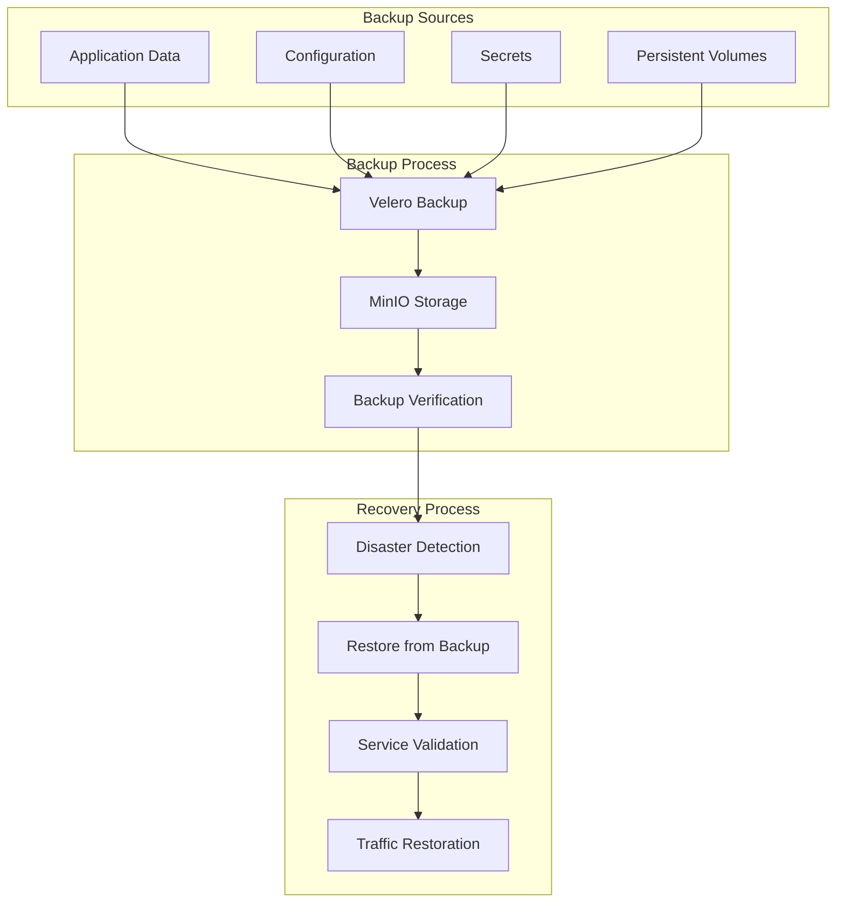

# DR Restore Runbook

This runbook covers disaster recovery and restore procedures using Velero with MinIO.

## Disaster Recovery Overview

Disaster recovery ensures business continuity by providing procedures to restore systems and data after a disaster. This implementation uses Velero for backup and restore operations with MinIO as the S3-compatible storage backend.

## Architecture



## Backup Configuration

### Velero Setup
```bash
# Install Velero
velero install \
  --provider aws \
  --plugins velero/velero-plugin-for-aws:v1.7.0 \
  --bucket velero-backups \
  --secret-file ./credentials-velero \
  --use-volume-snapshots=false \
  --backup-location-config region=minio,s3ForcePathStyle=true,s3Url=http://minio.minio.svc.cluster.local:9000 \
  --namespace velero
```

### MinIO Configuration
```yaml
# MinIO values
mode: standalone
auth:
  rootUser: minioadmin
  rootPassword: minioadmin123
defaultBuckets: "velero-backups"
persistence:
  enabled: true
  size: 20Gi
service:
  type: ClusterIP
  port: 9000
```

## Backup Procedures

### Manual Backup

#### Create Backup
```bash
# Create backup for specific namespace
velero backup create dev-backup --include-namespaces dev

# Create backup for multiple namespaces
velero backup create multi-namespace-backup --include-namespaces dev,staging,production

# Create backup with specific resources
velero backup create selective-backup --include-namespaces dev --include-resources deployments,services,configmaps
```

#### Schedule Backup
```bash
# Create daily backup schedule
velero schedule create daily-backup --schedule="0 2 * * *" --include-namespaces dev,staging,production

# Create weekly backup schedule
velero schedule create weekly-backup --schedule="0 2 * * 0" --include-namespaces dev,staging,production

# List backup schedules
velero schedule get
```

### Automated Backup

#### Backup Script
```bash
#!/bin/bash
# backup_script.sh

BACKUP_NAME="automated-backup-$(date +%Y%m%d-%H%M%S)"
NAMESPACES="dev,staging,production"

# Create backup
velero backup create ${BACKUP_NAME} --include-namespaces ${NAMESPACES}

# Verify backup
velero backup describe ${BACKUP_NAME}

# Clean up old backups (keep last 7 days)
velero backup delete --selector="backup.velero.io/schedule-name=daily-backup" --older-than=7d
```

#### Cron Job
```yaml
apiVersion: batch/v1
kind: CronJob
metadata:
  name: velero-backup
  namespace: velero
spec:
  schedule: "0 2 * * *"
  jobTemplate:
    spec:
      template:
        spec:
          containers:
          - name: velero-backup
            image: velero/velero:v1.12.0
            command:
            - /bin/bash
            - -c
            - |
              velero backup create automated-backup-$(date +%Y%m%d-%H%M%S) --include-namespaces dev,staging,production
            volumeMounts:
            - name: credentials
              mountPath: /credentials
          volumes:
          - name: credentials
            secret:
              secretName: velero-credentials
          restartPolicy: OnFailure
```

## Restore Procedures

### Manual Restore

#### Restore from Backup
```bash
# Restore specific namespace
velero restore create dev-restore --from-backup dev-backup

# Restore multiple namespaces
velero restore create multi-restore --from-backup multi-namespace-backup

# Restore with specific resources
velero restore create selective-restore --from-backup selective-backup --include-resources deployments,services
```

#### Restore to Different Namespace
```bash
# Restore to different namespace
velero restore create dev-restore-new --from-backup dev-backup --namespace-mappings dev:dev-new
```

### Automated Restore

#### Restore Script
```bash
#!/bin/bash
# restore_script.sh

BACKUP_NAME=$1
RESTORE_NAME="restore-$(date +%Y%m%d-%H%M%S)"

if [ -z "$BACKUP_NAME" ]; then
    echo "Usage: $0 <backup-name>"
    exit 1
fi

# Create restore
velero restore create ${RESTORE_NAME} --from-backup ${BACKUP_NAME}

# Wait for restore to complete
velero restore get ${RESTORE_NAME}

# Verify restore
kubectl get all -n dev
```

## Disaster Recovery Scenarios

### Scenario 1: Complete Namespace Loss

#### Detection
```bash
# Check namespace status
kubectl get namespace dev

# Check pod status
kubectl get pods -n dev

# Check service status
kubectl get services -n dev
```

#### Recovery
```bash
# Identify latest backup
velero backup get --selector="backup.velero.io/schedule-name=daily-backup" --sort-by=timestamp

# Restore from backup
velero restore create disaster-recovery-restore --from-backup <latest-backup>

# Verify restore
kubectl get all -n dev
```

### Scenario 2: Application Data Corruption

#### Detection
```bash
# Check application logs
kubectl logs -n dev deployment/flask-app

# Check application health
curl http://flask-app.local/api/health

# Check data integrity
kubectl exec -n dev deployment/flask-app -- python -c "import app; print('Data integrity check')"
```

#### Recovery
```bash
# Create backup of current state
velero backup create pre-recovery-backup --include-namespaces dev

# Restore from known good backup
velero restore create data-recovery-restore --from-backup <known-good-backup>

# Verify data integrity
kubectl exec -n dev deployment/flask-app -- python -c "import app; print('Data integrity verified')"
```

### Scenario 3: Infrastructure Failure

#### Detection
```bash
# Check cluster status
kubectl cluster-info

# Check node status
kubectl get nodes

# Check system pods
kubectl get pods -n kube-system
```

#### Recovery
```bash
# Recreate cluster
kind delete cluster --name devops-pipeline
kind create cluster --name devops-pipeline

# Reinstall Velero
velero install --provider aws --plugins velero/velero-plugin-for-aws:v1.7.0 --bucket velero-backups --secret-file ./credentials-velero

# Restore applications
velero restore create infrastructure-recovery-restore --from-backup <latest-backup>
```

## Recovery Testing

### Backup and Restore Demo

The `backup_restore_demo.sh` script provides comprehensive testing:

```bash
# Run complete demo
./backup_restore_demo.sh demo
```

### Manual Testing

#### Test Backup
```bash
# Create test data
kubectl create configmap test-data --from-literal=message="Test data for backup demo" -n dev
kubectl create secret generic test-secret --from-literal=password="backup-demo-password" -n dev

# Create backup
velero backup create test-backup --include-namespaces dev

# Verify backup
velero backup describe test-backup
```

#### Test Restore
```bash
# Delete test data
kubectl delete configmap test-data -n dev
kubectl delete secret test-secret -n dev

# Restore from backup
velero restore create test-restore --from-backup test-backup

# Verify restore
kubectl get configmap test-data -n dev
kubectl get secret test-secret -n dev
```

## Monitoring and Alerting

### Backup Monitoring

#### Check Backup Status
```bash
# List all backups
velero backup get

# Check backup details
velero backup describe <backup-name>

# Check backup logs
velero backup logs <backup-name>
```

#### Monitor Backup Schedules
```bash
# List backup schedules
velero schedule get

# Check schedule status
velero schedule describe <schedule-name>

# Check schedule logs
velero schedule logs <schedule-name>
```

### Restore Monitoring

#### Check Restore Status
```bash
# List all restores
velero restore get

# Check restore details
velero restore describe <restore-name>

# Check restore logs
velero restore logs <restore-name>
```

### Alerting Configuration

#### Prometheus Alerts
```yaml
groups:
- name: velero
  rules:
  - alert: VeleroBackupFailed
    expr: velero_backup_failed_total > 0
    for: 5m
    labels:
      severity: critical
    annotations:
      summary: "Velero backup failed"
      description: "Backup {{ $labels.backup_name }} has failed"
  
  - alert: VeleroRestoreFailed
    expr: velero_restore_failed_total > 0
    for: 5m
    labels:
      severity: critical
    annotations:
      summary: "Velero restore failed"
      description: "Restore {{ $labels.restore_name }} has failed"
```

## Troubleshooting

### Common Issues

#### Backup Failures
```bash
# Check Velero status
kubectl get pods -n velero

# Check Velero logs
kubectl logs -n velero deployment/velero

# Check backup status
velero backup describe <backup-name>

# Check backup logs
velero backup logs <backup-name>
```

#### Restore Failures
```bash
# Check restore status
velero restore describe <restore-name>

# Check restore logs
velero restore logs <restore-name>

# Check resource conflicts
kubectl get all -n <namespace>
```

#### MinIO Connection Issues
```bash
# Check MinIO status
kubectl get pods -n minio

# Check MinIO logs
kubectl logs -n minio deployment/minio

# Test MinIO connection
kubectl exec -n minio deployment/minio -- mc ls local/
```

### Recovery Procedures

#### Velero Recovery
```bash
# Restart Velero
kubectl rollout restart deployment/velero -n velero

# Check Velero status
kubectl get pods -n velero

# Verify Velero functionality
velero backup get
```

#### MinIO Recovery
```bash
# Restart MinIO
kubectl rollout restart deployment/minio -n minio

# Check MinIO status
kubectl get pods -n minio

# Verify MinIO functionality
kubectl exec -n minio deployment/minio -- mc ls local/
```

## Best Practices

### Backup Strategy

#### Backup Frequency
- **Development**: Daily backups
- **Staging**: Daily backups
- **Production**: Hourly backups

#### Backup Retention
- **Development**: 7 days
- **Staging**: 30 days
- **Production**: 90 days

#### Backup Verification
```bash
# Verify backup integrity
velero backup describe <backup-name>

# Test restore capability
velero restore create test-restore --from-backup <backup-name>
```

### Recovery Strategy

#### Recovery Time Objectives (RTO)
- **Development**: 30 minutes
- **Staging**: 15 minutes
- **Production**: 5 minutes

#### Recovery Point Objectives (RPO)
- **Development**: 24 hours
- **Staging**: 1 hour
- **Production**: 15 minutes

#### Recovery Procedures
```bash
# Document recovery procedures
cat > recovery-procedures.md << EOF
# Disaster Recovery Procedures

## Emergency Contacts
- DevOps Team: devops@company.com
- Platform Team: platform@company.com

## Recovery Steps
1. Assess the situation
2. Identify the latest backup
3. Execute recovery procedures
4. Verify system functionality
5. Notify stakeholders
EOF
```

## Next Steps

1. **Review Architecture**: Understand the [Architecture Overview](architecture.md)
2. **CI/CD Pipeline**: Check [CI/CD Pipeline Runbook](cicd-pipeline.md)
3. **GitOps Sync**: Review [GitOps Sync Runbook](gitops-sync.md)
4. **Blue-Green Deployment**: Check [Blue-Green Switch Runbook](blue-green-switch.md)
5. **Monitoring**: Review [Monitoring Guide](monitoring.md)
6. **Troubleshooting**: Refer to [Troubleshooting Guide](troubleshooting.md)
