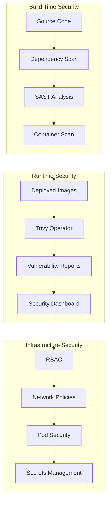

# Security Guide

This guide covers security best practices, configurations, and procedures for the DevOps Pipeline.

## Security Architecture



## Container Security

### Image Scanning

The pipeline includes comprehensive container security scanning:

#### Trivy CLI (CI/CD)
```bash
# Scan filesystem for vulnerabilities
trivy fs --severity HIGH,CRITICAL .

# Scan container images
trivy image --severity HIGH,CRITICAL flask-app:latest

# Generate SARIF report
trivy image --format sarif --output trivy-results.sarif flask-app:latest
```

#### Trivy Operator (Runtime)
```bash
# Check vulnerability reports
kubectl get vulnerabilityreports -A

# Get detailed report
kubectl describe vulnerabilityreport flask-app-<hash> -n dev
```

### Security Policies

#### Fail Build on High/Critical Vulnerabilities
```yaml
# .github/workflows/ci-cd.yml
- name: Install Trivy
  uses: aquasecurity/trivy-action@master
  with:
    scan-type: 'fs'
    scan-ref: '.'
    format: 'sarif'
    output: 'trivy-results.sarif'
    severity: 'HIGH,CRITICAL'
    ignore-unfixed: true
```

#### Container Security Standards
```dockerfile
# Use specific base image tags
FROM python:3.11-slim

# Run as non-root user
RUN useradd -m -u 1000 appuser
USER appuser

# Set resource limits
HEALTHCHECK --interval=30s --timeout=3s --start-period=5s --retries=3 \
    CMD curl -f http://localhost:5000/api/health || exit 1
```

## Kubernetes Security

### RBAC Configuration

#### ArgoCD Project RBAC
```yaml
# argocd/project.yaml
apiVersion: argoproj.io/v1alpha1
kind: AppProject
metadata:
  name: devops-pipeline-project
spec:
  roles:
  - name: admin
    description: Admin role
    policies:
    - p, proj:devops-pipeline-project:admin, applications, *, devops-pipeline-project/*, allow
    groups:
    - argocd-admins
  - name: developer
    description: Developer role
    policies:
    - p, proj:devops-pipeline-project:developer, applications, get, devops-pipeline-project/*, allow
    - p, proj:devops-pipeline-project:developer, applications, sync, devops-pipeline-project/dev-*, allow
    groups:
    - argocd-developers
```

#### Service Account Permissions
```yaml
# Minimal service account permissions
apiVersion: v1
kind: ServiceAccount
metadata:
  name: flask-app-sa
  namespace: dev
---
apiVersion: rbac.authorization.k8s.io/v1
kind: Role
metadata:
  name: flask-app-role
rules:
- apiGroups: [""]
  resources: ["configmaps", "secrets"]
  verbs: ["get", "list"]
```

### Network Security

#### Network Policies
```yaml
# Restrict pod-to-pod communication
apiVersion: networking.k8s.io/v1
kind: NetworkPolicy
metadata:
  name: flask-app-netpol
  namespace: dev
spec:
  podSelector:
    matchLabels:
      app: flask-app
  policyTypes:
  - Ingress
  - Egress
  ingress:
  - from:
    - namespaceSelector:
        matchLabels:
          name: ingress-nginx
    ports:
    - protocol: TCP
      port: 5000
  egress:
  - to:
    - podSelector:
        matchLabels:
          app: user-service
    ports:
    - protocol: TCP
      port: 5001
  - to:
    - podSelector:
        matchLabels:
          app: product-service
    ports:
    - protocol: TCP
      port: 5002
```

#### Pod Security Standards
```yaml
# Pod security context
apiVersion: apps/v1
kind: Deployment
metadata:
  name: flask-app
spec:
  template:
    spec:
      securityContext:
        runAsNonRoot: true
        runAsUser: 1000
        fsGroup: 1000
      containers:
      - name: flask-app
        securityContext:
          allowPrivilegeEscalation: false
          readOnlyRootFilesystem: true
          capabilities:
            drop:
            - ALL
```

## Secrets Management

### Kubernetes Secrets

#### Create Secrets
```bash
# Create application secrets
kubectl create secret generic flask-secrets \
  --from-literal=secret-key=your-secret-key \
  --namespace=dev

# Create database secrets
kubectl create secret generic db-secrets \
  --from-literal=username=dbuser \
  --from-literal=password=dbpassword \
  --namespace=dev
```

#### Use Secrets in Deployments
```yaml
apiVersion: apps/v1
kind: Deployment
metadata:
  name: flask-app
spec:
  template:
    spec:
      containers:
      - name: flask-app
        env:
        - name: SECRET_KEY
          valueFrom:
            secretKeyRef:
              name: flask-secrets
              key: secret-key
        - name: DB_PASSWORD
          valueFrom:
            secretKeyRef:
              name: db-secrets
              key: password
```

### External Secrets Management

#### AWS Secrets Manager
```yaml
# External Secrets Operator
apiVersion: external-secrets.io/v1beta1
kind: SecretStore
metadata:
  name: aws-secrets-manager
spec:
  provider:
    aws:
      service: SecretsManager
      region: us-west-2
      auth:
        secretRef:
          accessKeyID:
            name: aws-credentials
            key: access-key-id
          secretAccessKey:
            name: aws-credentials
            key: secret-access-key
---
apiVersion: external-secrets.io/v1beta1
kind: ExternalSecret
metadata:
  name: flask-secrets
spec:
  refreshInterval: 1h
  secretStoreRef:
    name: aws-secrets-manager
    kind: SecretStore
  target:
    name: flask-secrets
  data:
  - secretKey: secret-key
    remoteRef:
      key: flask-app/secrets
      property: secret-key
```

## Security Monitoring

### Vulnerability Scanning

#### Automated Scanning
```bash
# Check Trivy Operator status
kubectl get pods -n trivy-system

# View vulnerability reports
kubectl get vulnerabilityreports -A

# Get detailed report
kubectl describe vulnerabilityreport flask-app-<hash> -n dev
```

#### Manual Scanning
```bash
# Scan running pods
trivy k8s --severity HIGH,CRITICAL cluster

# Scan specific namespace
trivy k8s --severity HIGH,CRITICAL --namespace dev

# Scan specific resource
trivy k8s --severity HIGH,CRITICAL --namespace dev deployment/flask-app
```

### Security Dashboards

#### ArgoCD Security View
- Access ArgoCD at http://argocd.local
- Navigate to Applications
- Check application health and sync status
- Review resource utilization

#### Trivy Reports
```bash
# Generate HTML report
trivy image --format html --output trivy-report.html flask-app:latest

# Generate JSON report
trivy image --format json --output trivy-report.json flask-app:latest
```

## Security Best Practices

### Development

1. **Use Specific Base Images**: Avoid `latest` tags
2. **Minimize Attack Surface**: Use minimal base images
3. **Regular Updates**: Keep dependencies updated
4. **Code Review**: Implement mandatory code reviews
5. **Security Testing**: Include security tests in CI/CD

### Deployment

1. **Least Privilege**: Use minimal required permissions
2. **Network Segmentation**: Implement network policies
3. **Secrets Rotation**: Regularly rotate secrets
4. **Monitoring**: Monitor for security events
5. **Incident Response**: Have incident response procedures

### Operations

1. **Regular Scanning**: Schedule regular vulnerability scans
2. **Patch Management**: Implement patch management process
3. **Access Control**: Review and audit access regularly
4. **Backup Security**: Secure backup storage
5. **Compliance**: Maintain compliance with security standards

## Security Incident Response

### Incident Detection

#### Automated Detection
```bash
# Check for security events
kubectl get events --sort-by='.lastTimestamp' -A

# Check pod security violations
kubectl get pods --field-selector=status.phase=Failed -A

# Check network policy violations
kubectl logs -n kube-system deployment/calico-kube-controllers
```

#### Manual Detection
```bash
# Check for suspicious activity
kubectl get pods -A --field-selector=status.phase=Running

# Check resource usage
kubectl top pods -A

# Check network connections
kubectl exec -it <pod-name> -- netstat -tulpn
```

### Incident Response Procedures

1. **Isolate**: Isolate affected resources
2. **Investigate**: Analyze the incident
3. **Contain**: Prevent further damage
4. **Eradicate**: Remove the threat
5. **Recover**: Restore normal operations
6. **Learn**: Document lessons learned

### Emergency Procedures

#### Isolate Pod
```bash
# Scale down affected deployment
kubectl scale deployment flask-app --replicas=0 -n dev

# Delete suspicious pod
kubectl delete pod <pod-name> -n dev
```

#### Block Network Access
```bash
# Apply restrictive network policy
kubectl apply -f - <<EOF
apiVersion: networking.k8s.io/v1
kind: NetworkPolicy
metadata:
  name: block-all
  namespace: dev
spec:
  podSelector: {}
  policyTypes:
  - Ingress
  - Egress
EOF
```

#### Revoke Access
```bash
# Delete service account
kubectl delete serviceaccount <service-account> -n dev

# Revoke RBAC permissions
kubectl delete rolebinding <role-binding> -n dev
```

## Compliance and Auditing

### Security Auditing

#### Audit Logs
```bash
# Check Kubernetes audit logs
sudo tail -f /var/log/audit/audit.log | grep k8s

# Check ArgoCD audit logs
kubectl logs -n argocd deployment/argocd-server | grep audit
```

#### Compliance Checks
```bash
# Run CIS Kubernetes Benchmark
kube-bench run

# Check pod security standards
kubectl get pods -A -o jsonpath='{range .items[*]}{.metadata.name}{"\t"}{.spec.securityContext}{"\n"}{end}'
```

### Security Reporting

#### Generate Security Report
```bash
# Create security report
cat > security-report.md << EOF
# Security Report - $(date)

## Vulnerability Summary
$(trivy image --format table flask-app:latest)

## Compliance Status
$(kubectl get pods -A --field-selector=status.phase=Running | wc -l) pods running

## Network Policies
$(kubectl get networkpolicies -A | wc -l) network policies applied

## RBAC Configuration
$(kubectl get rolebindings -A | wc -l) role bindings configured
EOF
```

## Security Tools Integration

### GitHub Security Tab

The pipeline automatically uploads security scan results to GitHub Security tab:

```yaml
# .github/workflows/ci-cd.yml
- name: Upload Trivy scan results to GitHub Security tab
  uses: github/codeql-action/upload-sarif@v2
  if: always()
  with:
    sarif_file: 'trivy-results.sarif'
```

### Security Monitoring Tools

#### Prometheus Security Metrics
```yaml
# Security metrics configuration
apiVersion: v1
kind: ConfigMap
metadata:
  name: security-metrics
data:
  prometheus.yml: |
    rule_files:
    - "security_rules.yml"
    scrape_configs:
    - job_name: 'trivy-operator'
      kubernetes_sd_configs:
      - role: endpoints
        namespaces:
          names:
          - trivy-system
```

#### Grafana Security Dashboard
```json
{
  "dashboard": {
    "title": "Security Overview",
    "panels": [
      {
        "title": "Vulnerability Count",
        "type": "stat",
        "targets": [
          {
            "expr": "trivy_vulnerability_reports_total"
          }
        ]
      }
    ]
  }
}
```

## Next Steps

1. **Review Architecture**: Understand the [Architecture Overview](architecture.md)
2. **Monitor Security**: Set up [Monitoring](monitoring.md)
3. **Troubleshoot Issues**: Check [Troubleshooting Guide](troubleshooting.md)
4. **Operational Procedures**: Review [Runbooks](runbooks/)
5. **Compliance**: Implement compliance monitoring
6. **Incident Response**: Develop incident response procedures
